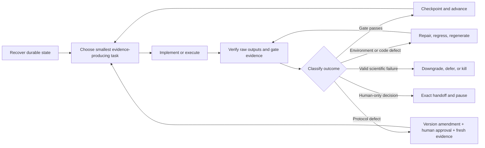

<div align="center">

# Rigorous Research Assistant

### From a research question to an auditable submission package

**Human-led, evidence-gated research execution for Codex and Claude Code.**

[](https://github.com/bsq415/research-rigor-skill/actions/workflows/validate.yml)
[](#human-control-is-a-feature)
[](#installation)
[](#installation)
[](#requirements)
[](LICENSE)

[简体中文](README.zh-CN.md) · [Capabilities](#what-it-can-actually-do) · [How it works](#bounded-autonomous-execution) · [Install](#installation) · [Disclaimer](DISCLAIMER.md)

</div>

> [!IMPORTANT]
> Rigorous Research Assistant is a research support tool, not an autonomous scientist or a scientific authority. It can execute a long research workflow, but it cannot guarantee novelty, correctness, validity, reproducibility, publication, or acceptance. The human research team owns the question, methods, interpretation, claims, authorship, ethics, privacy, disclosure, submission, and every resulting research output.

## What is it?

Rigorous Research Assistant is a portable Agent Skill that lets Codex, Claude Code, or another compatible coding agent help carry a researcher-directed project across the full lifecycle:

`question selection → literature and novelty → claim design → experiments → execution → result audit → correction or redesign → paper writing → manuscript audit → review → release`

It does more than return a plan. In **full-cycle mode**, it is instructed to inspect the live workspace, create the required artifacts, implement and run permitted work, verify outputs, persist its state, and continue to the next evidence-justified task without waiting for a new prompt after every routine step.

| Evidence-gated | Persistent | Fail-closed | Local-first | Cross-host |
|---|---|---|---|---|
| Claims advance only with traceable evidence | Work resumes from files, not chat memory | Missing or contradictory evidence blocks a pass | Private work stays local unless a human authorizes release | One canonical Skill for Codex and Claude Code |

> **Core principle:** engineering readiness and scientific validity are different. Passing tests proves that a pipeline runs; it does not prove a research claim.

## What it can actually do

The exact reach depends on the host's tools, source access, data, compute, credentials, and the authority granted by the researcher. Within those limits, the Skill can drive the following loop.

| Research phase | What the assistant can actively do | Auditable output or stop condition |
|---|---|---|
| **Recover and orient** | Inspect the real repository, instructions, dirty state, prior runs, constraints, privacy boundary, budgets, and frozen decisions; determine the earliest unpassed gate | Persistent stage, active task, blockers, next action, and acceptance condition |
| **Select a research question** | Generate technically distinct candidates; compare decision value, novelty risk, evidence feasibility, resource fit, falsifiers, and kill criteria; reject weak “method X + domain Y” ideas; recommend the strongest surviving candidate | Candidate ledger plus an explicit human-owned selection decision |
| **Review literature and attack novelty** | Search permitted sources, deduplicate records, perform source-anchored deep reading, build a forensic nearest-neighbor matrix, and construct the strongest “already done” argument | Search log, verified literature ledger, nearest-neighbor audit; `selected`, `deferred`, or `killed` outcome |
| **Design claims and theory** | Freeze at most three headline claims; define falsifiers, non-claims, baselines, denominators, effect thresholds, uncertainty, assumptions, boundary cases, counterexamples, and proof obligations | Claim-evidence matrix and theorem contract |
| **Design experiments** | Expand each claim into required baseline, ablation, control, boundary, seed, metric, denominator, pass, redesign, and kill cells; estimate coverage, failure rates, runtime, and cost; freeze a test policy | Executable experiment matrix, protocol, and coverage premortem |
| **Implement and execute** | Build the smallest complete pipeline; add provenance, hashes, deterministic IDs, interruption semantics, leakage/corruption tests, and append-only run records; pilot the most brittle path; run the frozen matrix when resources exist | Source and environment lock, tests, raw outputs, run ledger, manifests, and explicit partial/failure states |
| **Check results** | Verify planned versus produced coverage before headline effects; inspect provenance, raw-scale behavior, tails, peaks, trajectories, calibration, subgroups, missingness, denominators, uncertainty, power, baselines, counterexamples, and robustness | Sealed result-facts table with claim-level verdicts and limitations |
| **Correct experiments honestly** | Distinguish a transient environment fault, implementation bug, protocol or measurement defect, valid scientific failure, and authority/resource block; retry, quarantine and regenerate, reopen gates, redesign with fresh evidence, downgrade, defer, or kill as appropriate | Versioned amendment, invalidation record, regression test, fresh-validation evidence, or honest terminal result |
| **Write the paper** | Build the one-page argument, draft from sealed fact IDs, generate evidence-linked tables and figures, preserve contrary results and non-claims, compile and render the actual manuscript | Paper claim map connecting each statement to evidence tier, denominator, limitation, and source hash |
| **Audit the paper** | Check claims, citations, novelty positioning, notation, theory boundaries, baseline fidelity, numbers, units, statistics, figures, limitations, privacy, disclosure, reproducibility, build logs, page limits, and visual rendering | Manuscript-audit ledger; open fatal or major findings block progress |
| **Red-team and revise** | Simulate demanding reviewer perspectives, classify every request, turn accepted feedback into evidence or text changes, and rerun no-regression checks | Review-remediation matrix and preserved unresolved limitations |
| **Package and archive** | Build from an isolated source package, inspect every rendered page, scan for likely privacy leaks, create and verify a SHA-256 manifest, and record the canonical archive | Human-approved release checklist and reproducible archive, or a documented blocker |

The assistant can repeat `design → execute → inspect → correct → re-execute → re-inspect` when the correction is scientifically legitimate. It is explicitly forbidden to keep rerunning, changing metrics, deleting failures, or rewriting the story merely to obtain a preferred result.

## Bounded autonomous execution

“Full-cycle” means autonomous continuation of **authorized research work**. It does not mean autonomous scientific authority.



The durable controller records:

- current gate and status;
- active task and last checkpoint;
- evidence paths;
- blockers;
- next action;
- acceptance condition;
- whether an authorized human is required.

This lets a later turn—or another compatible agent—resume from inspectable artifacts instead of reconstructing the project from conversational memory.

## The experiment repair router

| Observed failure | Allowed response | Forbidden response |
|---|---|---|
| Environment or transient tool fault | Preserve logs, repair the environment, rerun the unchanged frozen cell | Quietly change model, data, metric, or budget |
| Implementation defect | Quarantine downstream artifacts, add a regression test, fix code, regenerate from unchanged upstream inputs | Edit reported rows in place |
| Measurement or protocol defect | Create a versioned amendment, identify invalidated artifacts, obtain required approval, validate on fresh held-out evidence, reopen dependent gates | Reuse contaminated evidence as confirmation |
| Valid scientific failure | Preserve it; narrow only with independent support; otherwise fail, defer, or kill | Label the result a “bug” because it is inconvenient |
| Missing authority, resource, privacy clearance, or external state | Record the exact blocker and prepare a reproducible handoff | Invent access, silently substitute a weaker study, or simulate completion |

## Human control is a feature

The assistant may autonomously handle reversible implementation details inside the signed execution contract. It must stop for decisions that materially change the research:

- final question, interpretation, claims, conclusions, authorship, or submission;
- ethics, consent, license, disclosure, privacy, or external release;
- uploading unpublished material to an external service;
- changing a frozen protocol after confirmatory results were inspected;
- selecting again after a locked test set was exposed;
- material spending, production changes, or destructive cleanup;
- two defensible paths that imply different scientific questions, risks, or conclusions.

Humans do not need to approve routine file naming, local diagnostics, test organization, or equivalent reversible implementation choices that leave the scientific contract unchanged.

## Twelve evidence gates

| Gate | Decision checkpoint |
|---|---|
| G0 | Orientation, constraints, authority, privacy, autonomy contract |
| G1 | Problem value and candidate screening |
| G2 | Literature coverage, nearest neighbors, and novelty attack |
| G3 | Claim and theory contract |
| G4 | Evidence and experiment design |
| G5 | Reproducible implementation |
| G6 | Brittle-path end-to-end pilot and protocol freeze |
| G7 | Frozen full execution |
| G8 | Result and statistical audit |
| G9 | Evidence-linked paper, figures, and manuscript audit |
| G10 | Reviewer red team and remediation |
| G11 | Submission package, privacy review, release, and archive |

Gate states are explicit:

`not_started · in_progress · passed · failed · blocked · paused · deferred · killed`

A failed gate remains part of the research record. A later discovery can reopen an earlier gate and invalidate every dependent stage without deleting historical artifacts.

## What is included

- A private-by-default `.research/` project control layer.
- Persistent full-cycle state and an append-only research-cycle log.
- Autonomy contract, question-candidate ledger, literature records, claim contract, experiment matrix, protocol-amendment ledger, run ledger, result-facts table, paper claim map, manuscript audit, reviewer remediation, and submission checklist.
- Protocols for question selection, literature, novelty, theory, experimental design, execution, statistics, correction, writing, review, privacy, release, and postmortem.
- Local Python tools to initialize or resume a project, enforce safe gate transitions, audit structure, seal artifacts, verify hashes, and scan releases.
- Human-operated workflows for external AI pre-review services.
- Cross-platform lifecycle tests on Windows and Linux.

## Tested behavior

The repository includes privacy-safe synthetic tests that verify:

- full-cycle initialization and persistent resume state;
- real Codex and Claude Code installation copies that can initialize and audit a project;
- automatic rollback when a gate is passed without evidence;
- automatic rollback when the human authority contract is incomplete;
- explicit reopening and invalidation of dependent gates;
- fresh held-out validation for an applied protocol amendment;
- preservation of a valid negative scientific outcome as `killed`, not `passed`;
- a complete synthetic G0 → G11 run;
- rejection of an unsupported manuscript claim until the major audit finding is resolved.

GitHub Actions runs the lifecycle suite on Windows and Linux with Python 3.11 and 3.13. These tests demonstrate workflow mechanics and fail-closed behavior; they do not certify the scientific validity of a user's project.

## Requirements

- Python 3.10 or newer for the bundled local utilities.
- Codex, Claude Code, or another directory-based Agent Skills host with a `SKILL.md` entrypoint.
- The data, literature access, compute, tools, and credentials required by the specific project.
- Appropriate human domain expertise, supervision, and authorization.

## Installation

```bash
git clone https://github.com/bsq415/research-rigor-skill.git
cd research-rigor-skill
```

The installer refuses to overwrite an existing Skill directory.

### Codex

```bash
python install.py --host codex --scope user
```

Start a full-cycle project:

```text
$research-rigor Work in full-cycle mode on this researcher-directed project.
Recover the live state, complete every reversible and authorized evidence-justified
step, implement and run permitted work, checkpoint artifacts, audit every result,
and stop only at a human-only decision or a documented blocker.
```

Request a narrower audit:

```text
$research-rigor Audit this workspace only. Report the current gate, verified evidence,
scientific gaps, engineering gaps, blockers, claim downgrades, and exact next action.
Do not mutate the project.
```

### Claude Code

Install for the current user:

```bash
python install.py --host claude-code --scope user
```

Or install for one repository:

```bash
python install.py --host claude-code --scope project --project-dir /path/to/project
```

Start the same full-cycle workflow:

```text
/research-rigor Work in full-cycle mode on this researcher-directed project.
Continue through topic screening, experiment design and execution, result checking,
legitimate correction or redesign, writing, and manuscript audit. Preserve failures
and stop at every human-only boundary.
```

Claude Code uses the same `SKILL.md`, references, templates, and scripts as Codex. See [platform compatibility](docs/PLATFORM_COMPATIBILITY.md).

### Manual installation

| Host | Destination | Invocation |
|---|---|---|
| Codex | `$CODEX_HOME/skills/research-rigor/` or `~/.codex/skills/research-rigor/` | `$research-rigor` |
| Claude Code, user | `~/.claude/skills/research-rigor/` | `/research-rigor` |
| Claude Code, project | `<project>/.claude/skills/research-rigor/` | `/research-rigor` |

## Direct project controls

Initialize:

```bash
python skills/research-rigor/scripts/init_research_project.py /path/to/project --mode full-cycle
```

Inspect resumable state:

```bash
python skills/research-rigor/scripts/research_cycle.py status /path/to/project
```

Run the structural audit:

```bash
python skills/research-rigor/scripts/audit_research_state.py /path/to/project
```

See command schemas:

```bash
python skills/research-rigor/scripts/research_cycle.py checkpoint --help
python skills/research-rigor/scripts/research_cycle.py transition --help
```

The structural audit checks records and invariants. It is deliberately not a novelty, theorem, statistics, or scientific-validity oracle.

## External AI reviewers

Rigorous Research Assistant can prepare the exact manuscript hash, privacy and upload checklist, raw-review record, and remediation ledger for a human-operated service such as Stanford Agentic Reviewer. It never uploads a private or unpublished manuscript automatically and never treats an AI score as peer-review authority.

Before any upload, an authorized human must check the service's current privacy, retention, deletion, data-use, and venue-policy terms. Every factual criticism and suggested citation still requires independent verification.

## Privacy and release safety

- Bundled scripts process local files and do not upload manuscripts.
- `.research/` is private by default.
- Public artifacts should exclude identities, private paths, unpublished results, distinctive unpublished ideas, credentials, and project-specific case material.
- `scan_release.py` checks common leak patterns and private deny terms without printing matched sensitive values.
- A clean automated scan is not proof of anonymity; a human semantic review remains mandatory.

## Repository layout

```text
research-rigor-skill/
├── .github/workflows/validate.yml
├── README.md
├── README.zh-CN.md
├── DISCLAIMER.md
├── LICENSE
├── install.py
├── tests/
└── skills/research-rigor/
    ├── SKILL.md
    ├── agents/openai.yaml
    ├── assets/project-scaffold/
    ├── references/
    └── scripts/
```

## Limits and responsibility

The Skill cannot supply missing subject-matter expertise, lawful data access, ethics approval, experimental resources, independent replication, or truthful external systems. Its structural checks cannot prove a theorem, certify novelty, validate a causal claim, or decide whether a paper deserves acceptance.

All generated code, searches, analyses, statistics, figures, prose, and decisions must be reviewed at the level appropriate to the research risk. Read the full [Disclaimer](DISCLAIMER.md).

## Contributing

Privacy-safe contributions are welcome:

- a general failure mode with a synthetic regression case;
- a stronger evidence, provenance, or manuscript check;
- a domain module that preserves human ownership and fail-closed gates;
- compatibility, documentation, or test improvements.

Do not submit private manuscripts, unpublished project details, personal data, credentials, proprietary datasets, or identifiable case material.

## License

Released under the [MIT License](LICENSE).

## Origin

Rigorous Research Assistant was distilled from generalized workflow lessons across multiple completed, incomplete, failed, and paused research efforts. The public repository contains no private paper content, project-specific results, personal identity, or proprietary case study.
