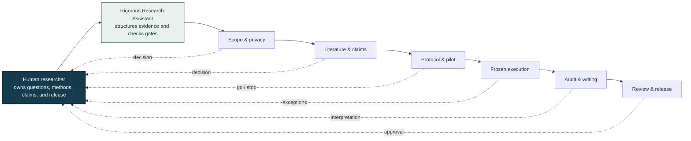

<div align="center">

# Rigorous Research Assistant

**A human-led research support skill for Codex and Claude Code.**

[](#human-control)
[](#installation)
[](#installation)
[](#requirements)
[](LICENSE)

</div>

> [!IMPORTANT]
> Rigorous Research Assistant is a research support tool, not an autonomous scientist. It does not certify scientific validity, replace expert judgment or peer review, or guarantee novelty, correctness, reproducibility, publication, or acceptance. The human research team remains responsible for every research decision and output.

<div align="center">

[简体中文](README.zh-CN.md) · [Why it exists](#why) · [Evidence gates](#the-twelve-evidence-gates) · [Installation](#installation) · [Disclaimer](DISCLAIMER.md) · [Compatibility](docs/PLATFORM_COMPATIBILITY.md)

</div>

## What is Rigorous Research Assistant?

Rigorous Research Assistant is a portable Agent Skill that helps researchers structure, audit, recover, and document work across the research lifecycle—from question framing and literature review to experiments, writing, review, release, and postmortem.

It adds explicit evidence gates, provenance records, reusable ledgers, and fail-closed stop rules to an AI-assisted workflow. It does not decide what is scientifically true. Humans choose the question, methods, evidence threshold, interpretation, claims, authorship, ethics, and release.

| **Evidence-gated** | **Human-led** | **Local-first** | **Portable** |
|---|---|---|---|
| Claims advance only with traceable evidence | Humans own methods, interpretation, and release | Private work stays local unless a human approves disclosure | One canonical skill for Codex and Claude Code |

> **Core principle:** engineering readiness and scientific validity are different. A passing test proves that a pipeline runs; it does not prove a research claim.

## Why?

AI assistants can produce code and prose quickly, but speed can hide scientific failure modes:

- a runnable pipeline mistaken for a validated result;
- test leakage or selection after seeing the test set;
- silent protocol, metric, or baseline changes;
- partial and failed runs promoted as complete evidence;
- theorem narratives that survive after a counterexample;
- plots and prose that drift away from raw results;
- private manuscript content sent to an external service without an explicit decision.

Rigorous Research Assistant makes these boundaries visible and auditable.

## What it is—and what it is not

| Rigorous Research Assistant helps with | Rigorous Research Assistant does not provide |
|---|---|
| A structured assistant for researcher-directed work | A fully autonomous research pipeline |
| A set of evidence gates, templates, and local audit tools | A scientific authority or correctness oracle |
| A way to preserve failures, provenance, and decision history | A system for manufacturing positive results |
| A guardrail for claims, experiments, writing, and release | A replacement for domain experts, coauthors, or reviewers |
| Compatible with Codex and Claude Code | A promise of publication or acceptance |

## Human control

The researcher remains the decision owner throughout the workflow.



Rigorous Research Assistant may prepare options, checks, artifacts, and handoffs. It must stop when progress requires a new scientific claim, changed protocol, exposed test set, ethics decision, authorship decision, confidential disclosure, paid resource, external upload, or other human-only authority.

## The twelve evidence gates

| Gate | Research checkpoint |
|---|---|
| G0 | Orientation, constraints, authority, privacy |
| G1 | Problem definition and value |
| G2 | Literature coverage and novelty attack |
| G3 | Claim and theory contract |
| G4 | Evidence and experimental design |
| G5 | Reproducible implementation |
| G6 | Brittle-path end-to-end pilot |
| G7 | Frozen full execution |
| G8 | Result and statistical audit |
| G9 | Evidence-linked paper and visuals |
| G10 | Review, red-team, and remediation |
| G11 | Submission, public release, and archive |

Gate states are explicit:

| State | Meaning |
|---|---|
| `not_started` | Work on the gate has not begun |
| `in_progress` | Work is active, but the gate has not passed |
| `passed` | Required evidence exists and has been checked |
| `failed` | A required scientific criterion did not survive |
| `blocked` | Progress requires missing evidence, access, or human authority |
| `paused` | Work is deliberately stopped pending a decision or reassessment |
| `deferred` | The direction remains viable but is currently infeasible |
| `killed` | The direction is falsified, non-novel, or deliberately terminated |

Failure is preserved as research information; it is not repaired by changing the story.

## Included

- A private-by-default `.research/` project scaffold.
- Claim–evidence, theorem, literature, nearest-neighbor, coverage, run, result, paper, and review ledgers.
- Protocols for idea selection, literature review, theory checks, experiments, statistics, paper writing, reviewer response, privacy, and archival.
- Local Python tools to initialize a project, audit state, seal an artifact package, verify hashes, and scan a release for likely privacy leaks.
- Manual-only handling for external AI reviewers.

## Requirements

- Python 3.10 or newer for the bundled audit utilities.
- Codex, Claude Code, or another host that supports directory-based Agent Skills with a `SKILL.md` entrypoint.
- Human review and domain expertise appropriate to the project.

## Installation

Clone the repository:

```bash
git clone https://github.com/bsq415/research-rigor-skill.git
cd research-rigor-skill
```

The installer refuses to overwrite an existing skill directory.

### Codex

```bash
python install.py --host codex --scope user
```

Invoke it explicitly with:

```text
$research-rigor Audit this research workspace. Report the current gate, verified evidence,
scientific gaps, engineering gaps, blockers, and the next justified action.
```

### Claude Code

Install for the current user:

```bash
python install.py --host claude-code --scope user
```

Or install only for one repository:

```bash
python install.py --host claude-code --scope project --project-dir /path/to/project
```

Invoke it explicitly with:

```text
/research-rigor Audit this research workspace. Do not change any frozen protocol or claim.
```

Claude Code discovers personal skills at `~/.claude/skills/<skill-name>/SKILL.md` and project skills at `.claude/skills/<skill-name>/SKILL.md`. Rigorous Research Assistant uses the same canonical skill files for both Claude Code and Codex.

### Manual installation

Copy `skills/research-rigor/` to one of these locations:

| Host | Destination | Invocation |
|---|---|---|
| Codex | `$CODEX_HOME/skills/research-rigor/` or `~/.codex/skills/research-rigor/` | `$research-rigor` |
| Claude Code, user | `~/.claude/skills/research-rigor/` | `/research-rigor` |
| Claude Code, project | `<project>/.claude/skills/research-rigor/` | `/research-rigor` |

## Example requests

```text
Use $research-rigor to initialize a private research control layer in this project.
Stop after reporting the proposed constraints and decisions that require my approval.
```

```text
/research-rigor Diagnose whether these experiments support the draft's main claims.
Treat passing tests and smoke runs as engineering evidence only.
```

```text
/research-rigor Convert this external review into a remediation ledger.
Verify every citation and do not accept the review score as scientific evidence.
```

## External AI reviewers

Rigorous Research Assistant can prepare a manuscript hash, upload checklist, and remediation ledger for services such as an agentic paper reviewer. It never treats those services as authoritative peer review and must not upload a private manuscript automatically.

Before a human uploads anything, check the service's current privacy, retention, deletion, data-use, and venue-policy terms. Preserve the exact reviewed file and raw response, verify every factual or citation-related suggestion, and route accepted changes through normal no-regression checks.

## Privacy and release safety

- Bundled scripts operate on local files and do not upload manuscripts.
- `.research/` is private by default.
- Public packages should exclude identities, private paths, unpublished results, distinctive unpublished ideas, credentials, and project-specific examples.
- `scan_release.py` checks common leak patterns and private deny terms without printing the matched sensitive values.
- A clean automated scan is not proof of anonymity; a human semantic review is still required.

## Repository layout

```text
research-rigor-skill/
├── README.md
├── README.zh-CN.md
├── DISCLAIMER.md
├── LICENSE
├── install.py
├── docs/
│   └── PLATFORM_COMPATIBILITY.md
└── skills/
    └── research-rigor/
        ├── SKILL.md
        ├── agents/
        ├── assets/project-scaffold/
        ├── references/
        └── scripts/
```

## Limitations

Rigorous Research Assistant is domain-agnostic. It cannot supply missing subject-matter knowledge, data rights, ethical approval, experimental resources, or independent replication. Structural checks can detect missing files and inconsistent records; they cannot prove a theorem, validate a causal claim, certify novelty, or determine whether a paper should be accepted.

Read the full [project disclaimer](DISCLAIMER.md) before use.

## Contributing

Privacy-safe contributions are welcome. Useful contributions include:

- a general failure mode with a synthetic regression case;
- a stronger evidence or provenance check;
- a domain module that preserves the human-control contract;
- documentation or compatibility improvements.

Do not submit private manuscripts, unpublished project details, personal data, credentials, proprietary datasets, or identifiable case material.

## License

Rigorous Research Assistant is released under the [MIT License](LICENSE).

## Origin

Rigorous Research Assistant was distilled from generalized workflow lessons across multiple completed, incomplete, failed, and paused research efforts. The public repository contains no private paper content, project-specific results, personal identity, or proprietary case study.
