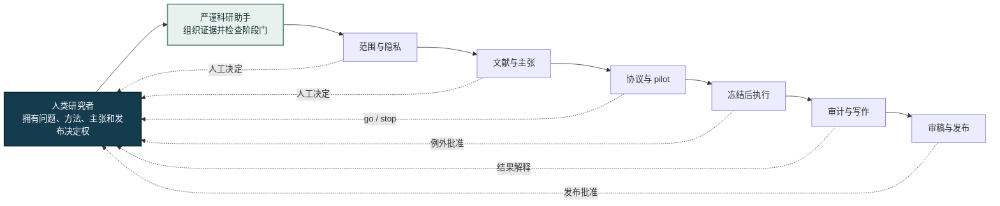

<div align="center">

# Rigorous Research Assistant · 严谨科研助手

**面向 Codex 与 Claude Code 的人主导、证据门控科研辅助 Skill。**

[](#人的主导权)
[](#安装)
[](#安装)
[](#环境要求)
[](LICENSE)

</div>

> [!IMPORTANT]
> 严谨科研助手是科研辅助工具，不是“自动科学家”。它不承担科研责任，不认证科学有效性，不能替代领域专家、共同作者或同行评审，也不保证创新性、正确性、可复现性、发表或录用。所有科研决策与产出均由研究者负责。

<div align="center">

[English](README.md) · [为什么需要它](#为什么需要它) · [十二个证据门](#十二个证据门) · [安装](#安装) · [完整免责声明](DISCLAIMER.md) · [平台兼容说明](docs/PLATFORM_COMPATIBILITY.md)

</div>

## 严谨科研助手是什么？

Rigorous Research Assistant（中文名：**严谨科研助手**）是一个可移植的 Agent Skill，用来辅助研究者组织、审计、恢复和记录科研工作。它可以服务于问题定义、文献检索、创新性审查、理论与实验、结果分析、论文写作、审稿整改、发布和复盘等阶段，但不会代替人决定“什么是科学事实”。

它提供的是证据门、来源记录、科研账本和 fail-closed 停止规则。研究问题、方法、证据标准、解释、主张、署名、伦理和公开发布始终由人决定。

| **证据驱动** | **人类主导** | **本地优先** | **双平台兼容** |
|---|---|---|---|
| 主张只能随可追溯证据推进 | 方法、解释与发布始终由人决定 | 未经人工批准，私密材料不会对外披露 | Codex 与 Claude Code 共用同一权威 Skill |

> **核心原则：** 工程就绪不等于科学有效。测试通过只能说明流程能够运行，不能证明科研主张成立。

## 为什么需要它？

AI 可以快速生成代码和文字，但速度也容易掩盖科研风险：

- 把“代码能运行”误认为“科学结论成立”；
- 看过 test set 后继续选模型或改方案；
- 静默更换 protocol、metric、baseline 或数据划分；
- 把 partial、失败或中断实验包装成完整结果；
- 理论已出现反例，叙事却继续保留原主张；
- 图表与正文逐渐脱离原始结果；
- 未经人工决定就把私密稿件上传到外部服务。

严谨科研助手的作用是让这些边界可见、可查、可追责。

## 它是什么、不是什么

| 严谨科研助手可以辅助 | 严谨科研助手不提供 |
|---|---|
| 研究者主导工作中的结构化助手 | 全自动科研流水线 |
| 证据门、模板、账本和本地审计工具 | 科学权威或正确性裁判 |
| 保存失败、provenance 与决策历史的方法 | 制造正结果或美化失败的工具 |
| 面向 claim、实验、写作与发布的护栏 | 领域专家、共同作者或 reviewer 的替代品 |
| 同时兼容 Codex 与 Claude Code | 发表或录用承诺 |

## 人的主导权



严谨科研助手可以准备选项、检查、artifact 和 handoff；一旦涉及新科学主张、冻结协议变更、test set 暴露、伦理与署名、机密披露、付费资源或外部上传，就必须停下来交由人决定。

## 十二个证据门

| Gate | 检查点 |
|---|---|
| G0 | 定向、约束、权限与隐私 |
| G1 | 问题定义与研究价值 |
| G2 | 文献覆盖与 novelty 否证 |
| G3 | Claim 与理论合同 |
| G4 | 证据和实验设计 |
| G5 | 可复现实现 |
| G6 | 最脆弱路径的端到端 pilot |
| G7 | 协议冻结后的全量执行 |
| G8 | 结果与统计审计 |
| G9 | 证据绑定的论文和图表 |
| G10 | Review、red-team 与整改 |
| G11 | 投稿、公开发布与归档 |

每个 Gate 的状态与含义如下：

| 状态 | 含义 |
|---|---|
| `not_started` | 尚未开始处理该 Gate |
| `in_progress` | 正在处理，但尚未通过 |
| `passed` | 所需证据已经存在并完成核验 |
| `failed` | 必要的科学判据未能成立 |
| `blocked` | 缺少证据、访问条件或人工授权 |
| `paused` | 等待人工决定或重新评估而主动暂停 |
| `deferred` | 方向仍可行，但当前条件不足 |
| `killed` | 方向已被否证、不再新颖或明确终止 |

失败必须作为科研信息保留，不能靠改写故事消失。

## 内含组件

- 默认私有的 `.research/` 科研控制层。
- 文献、最近工作、claim–evidence、理论、coverage、run、result、论文和 review 账本。
- 覆盖选题、理论、实验、统计、写作、审稿、隐私和归档的协议。
- 初始化项目、审计状态、密封 artifact、验证哈希和扫描发布泄漏的本地 Python 工具。
- 只能由人手动操作的外部 AI reviewer 流程。

## 环境要求

- Python 3.10 或更高版本。
- Codex、Claude Code，或其他支持目录式 `SKILL.md` 的 Agent Skills host。
- 与项目相匹配的人类领域知识和审查。

## 安装

```bash
git clone https://github.com/bsq415/research-rigor-skill.git
cd research-rigor-skill
```

安装器发现目标目录已存在时会拒绝覆盖。

### Codex

```bash
python install.py --host codex --scope user
```

调用示例：

```text
$research-rigor 审计当前科研目录，报告当前 gate、已验证证据、科学缺口、
工程缺口、阻塞项和下一项有证据支持的行动。
```

### Claude Code

安装为用户级 Skill：

```bash
python install.py --host claude-code --scope user
```

只安装到某个项目：

```bash
python install.py --host claude-code --scope project --project-dir /path/to/project
```

调用示例：

```text
/research-rigor 审计当前科研项目。不得改变任何已经冻结的 protocol 或 claim。
```

Claude Code 的用户级目录是 `~/.claude/skills/research-rigor/`，项目级目录是 `.claude/skills/research-rigor/`。Codex 与 Claude Code 使用仓库中的同一个权威 Skill 副本。

## 外部 AI reviewer

严谨科研助手可以为 Stanford Agentic Reviewer 一类服务准备稿件 hash、人工上传检查表和 remediation ledger，但不会自动上传私密稿件，也不会把外部 AI reviewer 当成正式同行评审。

人工上传前应检查服务当日的 privacy、retention、deletion、data-use 条款与 venue policy。必须保存被审 PDF 的准确副本和原始 review，逐项核验事实及引用，并让所有接受的修改重新经过证据和 no-regression 检查。

## 隐私与公开发布

- 随附脚本只处理本地文件，不上传论文。
- `.research/` 默认视为私有工作区。
- 公开包应排除个人身份、私有路径、未公开结果、独特的未公开 idea、凭据和项目专属案例。
- `scan_release.py` 会检查常见泄漏模式和私有 deny terms，但不会把命中的敏感内容打印出来。
- 自动扫描通过并不等于匿名性成立，仍须人工做语义审查。

## 局限

严谨科研助手是通用工具，不能补足缺失的领域知识、数据权利、伦理批准、实验资源或独立复现。结构审计可以发现缺文件和记录冲突，但不能证明定理、验证因果关系、认证创新性或判断论文是否应该录用。

使用前请阅读[完整免责声明](DISCLAIMER.md)。

## 贡献

欢迎不包含隐私内容的贡献，例如：

- 带有合成 regression case 的通用失败模式；
- 更严格的证据或 provenance 检查；
- 不削弱人类决策权的领域模块；
- 文档和平台兼容性改进。

请勿提交私密稿件、未发表项目细节、个人数据、凭据、专有数据集或可识别案例。

## License

严谨科研助手使用 [MIT License](LICENSE)。

## 来源说明

严谨科研助手来自多个已完成、未完成、失败和暂停科研项目中的通用流程经验。公开仓库不包含任何私密论文内容、项目专属结果、个人身份或专有案例。
