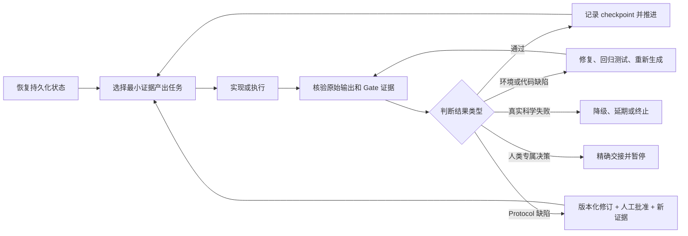

<div align="center">

# Rigorous Research Assistant · 严谨科研助手

### 从科研问题到可审计投稿包

**人类主导、证据门控，面向 Codex 与 Claude Code 的科研执行 Skill。**

[](https://github.com/bsq415/research-rigor-skill/actions/workflows/validate.yml)
[](#人类主导是能力不是限制)
[](#安装)
[](#安装)
[](#环境要求)
[](LICENSE)

[English](README.md) · [真正能做什么](#它真正能做什么) · [如何持续执行](#有边界的自主执行) · [安装](#安装) · [免责声明](DISCLAIMER.md)

</div>

> [!IMPORTANT]
> 严谨科研助手是科研辅助工具，不是“自动科学家”，也不是科学权威。它可以持续执行很长的科研流程，但不保证创新性、正确性、科学有效性、可复现性、发表或录用。研究问题、方法、结果解释、主张、署名、伦理、隐私、披露、投稿以及全部科研产出，始终由人类研究团队决定并负责。

## 它是什么？

严谨科研助手是一个可移植的 Agent Skill，让 Codex、Claude Code 或其他兼容的 coding agent，围绕研究者主导的项目协助完成科研全流程：

`选题 → 文献与创新性 → 主张设计 → 实验设计 → 实验执行 → 结果核查 → 修正或重设计 → 论文撰写 → 全文核查 → 审稿整改 → 投稿与归档`

它不只是给一份计划。在 **full-cycle 模式**下，它会检查真实工作区、创建必要产物、实现并运行获得授权的任务、核验输出、持久化当前状态，并在每个日常步骤后自动继续到下一个有证据支撑的动作，不需要研究者逐句催促。

| 证据门控 | 可断点续作 | Fail-closed | 本地优先 | 双平台 |
|---|---|---|---|---|
| 主张必须有可追溯证据才能推进 | 从文件恢复，不依赖聊天记忆 | 证据缺失或矛盾时拒绝过门 | 未经人工授权不对外发送私有材料 | Codex 与 Claude Code 共用同一份权威 Skill |

> **核心原则：** 工程就绪不等于科学有效。测试通过只能说明流程能够运行，不能证明科研主张成立。

## 它真正能做什么

实际能力取决于宿主提供的工具、文献访问、数据、算力、凭据，以及研究者授予的操作范围。在这些边界内，它可以主动驱动以下工作。

| 科研阶段 | 助手可以主动完成的工作 | 可审计产物或停止条件 |
|---|---|---|
| **恢复与定向** | 检查真实仓库、项目指令、未提交修改、既有实验、隐私边界、预算和已经冻结的决定；找到最早尚未通过的 Gate | 当前阶段、活动任务、阻塞项、下一动作和验收条件 |
| **合理选题** | 生成技术上不同的候选问题；比较决策价值、创新风险、证据可行性、资源适配、falsifier 与 kill criteria；否决单纯“方法 X + 领域 Y”的弱选题；推荐最有希望的候选 | 选题候选账本，以及由人类决策负责人确认的选择 |
| **文献检索与创新性否证** | 在允许的数据源中检索、去重、深读并记录原文锚点；构造 forensic nearest-neighbor matrix；主动建立最强“已有人做过”论证 | 检索日志、文献账本、最近工作矩阵；得到 `selected`、`deferred` 或 `killed` |
| **主张与理论设计** | 冻结不超过三条 headline claim；写明 falsifier、non-claims、强基线、有效分母、效应阈值、不确定性、假设、边界情形、反例和证明义务 | Claim-evidence matrix 与 theorem contract |
| **实验设计** | 把每条主张展开为基线、ablation、control、边界、seed、metric、denominator、pass、redesign 和 kill cells；估算 coverage、失败率、时间和成本；冻结 test policy | 可执行实验矩阵、实验协议和 coverage premortem |
| **实现与实验执行** | 建立最小但完整的 pipeline；加入 provenance、hash、确定性 ID、断点恢复、泄漏/损坏测试和 append-only run ledger；先跑最脆弱路径的 pilot，再在资源允许时执行冻结矩阵 | 代码、环境锁、测试、原始输出、run ledger、manifest，以及明确的 partial / failed 状态 |
| **结果核查** | 先检查 planned / produced / parsed / valid / paired / green / undefined / failed，再看 headline effect；核验 raw scale、tails、peaks、trajectory、calibration、subgroup、missingness、denominator、uncertainty、power、强基线、反例和 robustness | 密封的 result-facts table、逐主张 verdict 和限制 |
| **诚实修正实验** | 区分环境故障、实现 bug、测量或 protocol 缺陷、真实科学失败、权限/资源阻塞；分别执行原协议重试、隔离重算、版本化修订与新证据验证、降级/延期/终止或人工交接 | 协议修订账本、失效产物清单、回归测试、新 held-out evidence，或诚实的终止结论 |
| **论文撰写** | 先构造 one-page paper，再从 sealed fact IDs 生成正文、表格和图；保留相反证据、分母、限制和 non-claims；编译并渲染真实稿件 | 每个论文表述都连接 evidence tier、denominator、limitation 与 source hash 的 paper claim map |
| **论文全文核查** | 核查主张、引用、创新性定位、符号、理论边界、基线公平性、数值、单位、统计、图表、限制、隐私、披露、可复现性、编译日志、页数和视觉效果 | Manuscript audit ledger；未解决的 `fatal` 或 `major` 问题会阻止过门 |
| **Reviewer red-team 与整改** | 模拟严格 reviewer，从 novelty、soundness、evidence、reproducibility、scope 和 presentation 等角度攻击；分类每条意见；把接受的意见转化成证据或文本修改并执行 no-regression 检查 | Review-remediation matrix，以及明确保留的未解决限制 |
| **投稿包与归档** | 在隔离目录重建 source package，检查每一页，扫描潜在隐私泄漏，生成并验证 SHA-256 manifest，记录 canonical archive | 人工确认后的发布检查表与可复现归档，或清晰的 blocker |

只要修正是科学上正当的，它可以反复执行：

`设计 → 执行 → 检查 → 修正 → 重新执行 → 再检查`

但它被明确禁止为了得到“更好看”的结论而选择性重跑、偷换 metric、删除失败样本或改写研究故事。

## 有边界的自主执行

这里的“全流程”是指在授权范围内自主继续执行科研工作，不是把科学决策权交给 AI。



持久化执行器会记录：

- 当前 Gate 与状态；
- 活动任务和最后一个 checkpoint；
- 证据路径；
- blockers；
- 下一动作；
- 验收条件；
- 当前是否必须由授权人处理。

因此，后续对话甚至另一个兼容 agent 可以从可检查的文件继续，而不是依赖模糊的聊天记忆重建整个项目。

## 实验失败如何分流

| 失败类型 | 允许的处理 | 明确禁止 |
|---|---|---|
| 环境或临时工具故障 | 保存日志，修复环境，在完全相同的冻结协议下重试 | 静默更换模型、数据、metric 或预算 |
| 实现缺陷 | 隔离所有下游产物，增加能复现旧 bug 的 regression test，修复后从未改变的上游输入重新生成 | 直接手改结果行 |
| 测量或 protocol 缺陷 | 建立版本化 amendment，列出失效产物，获得必要批准，用新的 held-out evidence 验证并重开依赖 Gate | 把已经污染的结果继续当 confirmatory evidence |
| 真实科学失败 | 保存并报告；只有独立证据支持时才能缩小主张，否则 `failed`、`deferred` 或 `killed` | 因为结果不理想就把它叫做“代码 bug” |
| 缺权限、资源、隐私许可或外部状态 | 写清 blocker，准备最小且可复现的人工交接 | 编造访问能力、静默换成更弱的问题或假装已完成 |

## 人类主导是能力，不是限制

在已经签订的 autonomy contract 内，助手可以自主处理可逆的实现细节。但下面这些决定必须停下来交给人：

- 最终研究问题、结果解释、主张、结论、署名或投稿；
- 伦理、知情同意、license、披露、隐私与外部发布；
- 把未公开材料上传到外部服务；
- 看过 confirmatory results 后修改冻结 protocol；
- 暴露 locked test set 后再次做选择；
- 实质性付费、生产系统改动或破坏性清理；
- 两条都合理、但会导向不同科学问题、风险或结论的路线。

普通文件命名、本地诊断、测试组织和不改变科研协议的等价实现细节，不需要逐项等待人工点击确认。

## 十二个证据 Gate

| Gate | 决策检查点 |
|---|---|
| G0 | 定向、约束、权限、隐私和 autonomy contract |
| G1 | 问题价值与候选筛选 |
| G2 | 文献覆盖、nearest neighbors 与创新性否证 |
| G3 | Claim 与理论合同 |
| G4 | 证据与实验设计 |
| G5 | 可复现实现 |
| G6 | 最脆弱路径端到端 pilot 与 protocol freeze |
| G7 | 冻结协议下的全量执行 |
| G8 | 结果与统计审计 |
| G9 | 证据绑定的论文、图表和 manuscript audit |
| G10 | Reviewer red-team 与 remediation |
| G11 | 投稿包、隐私检查、发布与归档 |

Gate 状态固定为：

`not_started · in_progress · passed · failed · blocked · paused · deferred · killed`

失败不会被删掉。后续发现也可以重开更早的 Gate，使全部下游阶段失效，同时保留历史产物和决策记录。

## 内含组件

- 默认私有的 `.research/` 项目控制层；
- 可断点续作的 full-cycle 状态与 append-only research-cycle log；
- 自主边界契约、选题候选账本、文献账本、claim contract、实验矩阵、protocol amendment ledger、run ledger、result-facts table、paper claim map、manuscript audit、reviewer remediation 和 submission checklist；
- 覆盖选题、文献、创新性、理论、实验设计、执行、统计、修正、写作、审稿、隐私、发布与复盘的协议；
- 用于初始化、恢复、安全 Gate 转换、结构审计、artifact 密封、hash 验证和发布扫描的本地 Python 工具；
- 面向外部 AI pre-review 服务的人工操作流程；
- Windows 与 Linux 跨平台生命周期测试。

## 已验证的行为

仓库内含不涉及任何真实论文或私人项目的合成测试，验证以下行为：

- full-cycle 初始化和持久化恢复；
- Codex 与 Claude Code 的真实安装副本能够初始化并审计项目；
- 没有证据却尝试过门时自动回滚；
- 人工授权契约未完成时自动回滚；
- 重开早期 Gate 时明确使下游 Gate 失效；
- protocol amendment 应用后必须存在新的 held-out validation；
- 真实负面科研结果保持为 `killed`，不会变成 `passed`；
- 一个完整的合成 G0 → G11 流程；
- 论文存在无证据支撑的重大表述时拒绝过门，完成整改后才允许继续。

GitHub Actions 会在 Windows、Linux 以及 Python 3.11、3.13 上运行生命周期测试。这些测试证明的是工作流机制和 fail-closed 行为，不是对使用者科研项目的科学有效性认证。

## 环境要求

- Python 3.10 或更高版本；
- Codex、Claude Code，或其他支持目录式 `SKILL.md` 的 Agent Skills host；
- 具体项目所需的数据、文献权限、算力、工具和凭据；
- 与项目风险相匹配的人类领域知识、监督和授权。

## 安装

```bash
git clone https://github.com/bsq415/research-rigor-skill.git
cd research-rigor-skill
```

安装器发现目标 Skill 目录已存在时会拒绝覆盖。

### Codex

```bash
python install.py --host codex --scope user
```

启动全流程模式：

```text
$research-rigor 以 full-cycle 模式推进这个由我主导的科研项目。
先恢复真实状态，然后持续完成所有可逆、已授权且有证据依据的步骤；
实现并运行允许的任务，保存 checkpoint，核查每一轮结果。
只在人类专属决定或已有明确 blocker 时停下来。
```

只做审计：

```text
$research-rigor 只审计当前科研工作区，不修改文件。
报告当前 Gate、已验证证据、科学缺口、工程缺口、blockers、
主张降级情况、下一项准确动作及其验收条件。
```

### Claude Code

安装为用户级 Skill：

```bash
python install.py --host claude-code --scope user
```

只安装到一个项目：

```bash
python install.py --host claude-code --scope project --project-dir /path/to/project
```

启动同一套全流程：

```text
/research-rigor 以 full-cycle 模式推进这个由我主导的科研项目。
持续进行选题筛选、实验设计与执行、结果核查、正当修正或重设计、
论文撰写和全文核查。保留失败，并在每个人类专属边界停下。
```

Claude Code 与 Codex 共用同一份 `SKILL.md`、references、templates 和 scripts。详见[平台兼容说明](docs/PLATFORM_COMPATIBILITY.md)。

### 手动安装

| Host | 目标目录 | 调用方式 |
|---|---|---|
| Codex | `$CODEX_HOME/skills/research-rigor/` 或 `~/.codex/skills/research-rigor/` | `$research-rigor` |
| Claude Code，用户级 | `~/.claude/skills/research-rigor/` | `/research-rigor` |
| Claude Code，项目级 | `<project>/.claude/skills/research-rigor/` | `/research-rigor` |

## 直接使用项目控制器

初始化：

```bash
python skills/research-rigor/scripts/init_research_project.py /path/to/project --mode full-cycle
```

查看可恢复状态：

```bash
python skills/research-rigor/scripts/research_cycle.py status /path/to/project
```

执行结构审计：

```bash
python skills/research-rigor/scripts/audit_research_state.py /path/to/project
```

查看 checkpoint 和 transition 参数：

```bash
python skills/research-rigor/scripts/research_cycle.py checkpoint --help
python skills/research-rigor/scripts/research_cycle.py transition --help
```

结构审计只检查记录与不变量，不会冒充创新性、定理、统计或科学有效性的裁判。

## 外部 AI Reviewer

严谨科研助手可以为 Stanford Agentic Reviewer 一类由人手动操作的服务准备：待审稿件的精确 hash、隐私与上传检查表、原始 review 记录和 remediation ledger。它不会自动上传私有或未公开论文，也不会把 AI score 当成同行评审权威。

任何上传都必须由授权人先检查服务当时的 privacy、retention、deletion、data-use 和 venue policy。AI 提出的事实批评和引用建议仍须独立核验。

## 隐私与公开发布

- 随附脚本只处理本地文件，不会自动上传论文；
- `.research/` 默认视为私有；
- 公开产物应排除个人身份、私有路径、未公开结果、独特的未公开 idea、credentials 和项目专属案例；
- `scan_release.py` 会检查常见泄漏模式和私有 deny terms，但不打印命中的敏感值；
- 自动扫描通过不等于匿名性成立，仍须人工语义审查。

## 仓库结构

```text
research-rigor-skill/
├── .github/workflows/validate.yml
├── README.md
├── README.zh-CN.md
├── DISCLAIMER.md
├── LICENSE
├── install.py
├── tests/
└── skills/research-rigor/
    ├── SKILL.md
    ├── agents/openai.yaml
    ├── assets/project-scaffold/
    ├── references/
    └── scripts/
```

## 局限与责任

本 Skill 不能补足缺失的领域知识、合法数据权限、伦理批准、实验资源、独立复现或可信外部系统。它的结构检查不能证明定理、认证创新性、验证因果主张或决定论文是否应被录用。

所有生成的代码、检索、分析、统计、图表、文字和决策，都必须按科研风险进行相应层级的人类审查。使用前请阅读完整[免责声明](DISCLAIMER.md)。

## 贡献

欢迎不含隐私内容的贡献，例如：

- 带合成 regression case 的通用失败模式；
- 更强的 evidence、provenance 或 manuscript check；
- 不削弱人类所有权和 fail-closed Gate 的领域模块；
- 兼容性、文档或测试改进。

请勿提交私有稿件、未发表项目细节、个人数据、credentials、专有数据集或可识别案例。

## License

本项目采用 [MIT License](LICENSE)。

## 来源说明

严谨科研助手由多个已完成、未完成、失败和暂停科研任务中的通用流程经验蒸馏而来。公开仓库不包含任何私有论文内容、项目专属结果、个人身份或专有案例。
